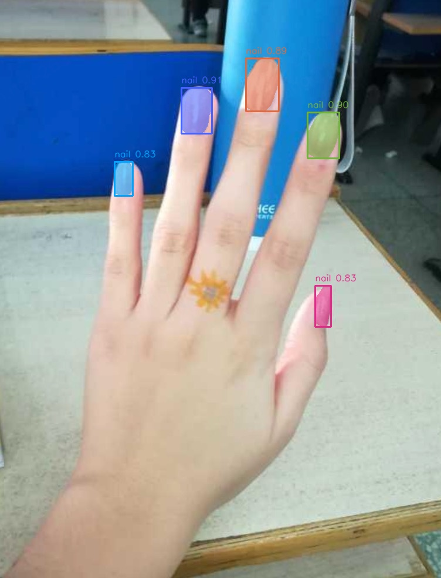

# Nail Try-On Segmentation（YOLOv8s-seg + ONNX Runtime CPU）

[English](./README.md) | [中文](./README-CN.md)

这是一个用于指甲实例分割与轻量试妆流程的基线项目。

## 功能特性

- 使用 `onnxruntime`（CPU）进行 ONNX 模型推理
- 提供本地 CLI 推理脚本
- 提供 Gradio Web Demo（上传、分割、示例）
- 支持导出 mask 与 overlay 可视化结果

## 项目结构

```text
.
├── models/
│   └── nail-seg.onnx
├── scripts/
│   ├── onnx_seg_utils.py
│   ├── infer_seg_onnx.py
│   └── demo_gradio.py
├── examples/
│   ├── input/
│   ├── output_mask/
│   ├── output_overlay/
│   └── output_tryon/
├── pyproject.toml
├── uv.lock
├── .gitignore
├── README.md
└── README-CN.md
```

## 环境要求

- Python 3.10+
- `uv`

## 安装（uv）

```bash
uv python install 3.10
uv venv --python 3.10
source .venv/bin/activate
uv sync --frozen
```

## Demo 效果

| 原图 | Mask 图 | Overlay 图 |
|---|---|---|
|  |  |  |
|  |  |  |

## Benchmark（基准测试）

环境信息：

- CPU：Intel(R) Core(TM) i7-7800X CPU @ 3.50GHz（6 核 12 线程）
- Runtime：ONNX Runtime CPUExecutionProvider
- Session 默认值：`intra_op_num_threads=0`、`inter_op_num_threads=0`、`execution_mode=ORT_SEQUENTIAL`、`graph_optimization_level=ORT_ENABLE_ALL`

输入图像：

- `examples/input/1.jpg`：`752 x 984`
- `examples/input/2.jpg`：`902 x 1088`

测试方法：

- 预热：1 次
- 正式测试：10 次（同一进程，2 张图交替）
- 模型：`models/nail-seg.onnx`
- 参数：`conf=0.25`、`iou=0.45`、`mask_thr=0.5`、`min_area_ratio=0.01`

延时结果（ms）：

- 平均值 Mean：`290.10`
- P50：`291.06`
- P90：`303.75`
- 最小/最大：`274.40 / 304.76`
- 按均值折算吞吐：`3.45 FPS`

> 说明：以上结果来自本机实测，不同 CPU 型号、系统负载、运行参数下会有波动。

## CLI 推理

脚本：`scripts/infer_seg_onnx.py`

```bash
python scripts/infer_seg_onnx.py \
  --model models/nail-seg.onnx \
  --input examples/input \
  --out outputs \
  --conf 0.25 \
  --iou 0.45
```

输出结果：

- 二值 mask：`output_mask/`
- 实例叠加图：`output_overlay/`

## Gradio Demo

脚本：`scripts/demo_gradio.py`

```bash
python scripts/demo_gradio.py \
  --model models/nail-seg.onnx \
  --example_dir examples/input \
  --host 127.0.0.1 \
  --port 7860
```

浏览器访问：[http://127.0.0.1:7860](http://127.0.0.1:7860)

## 说明

- 适用于消费级视觉效果（如试色前处理）
- 非医疗用途
- 在强反光、重遮挡、极端姿态下效果可能下降
